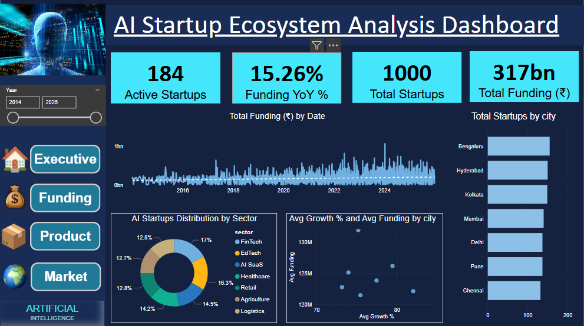
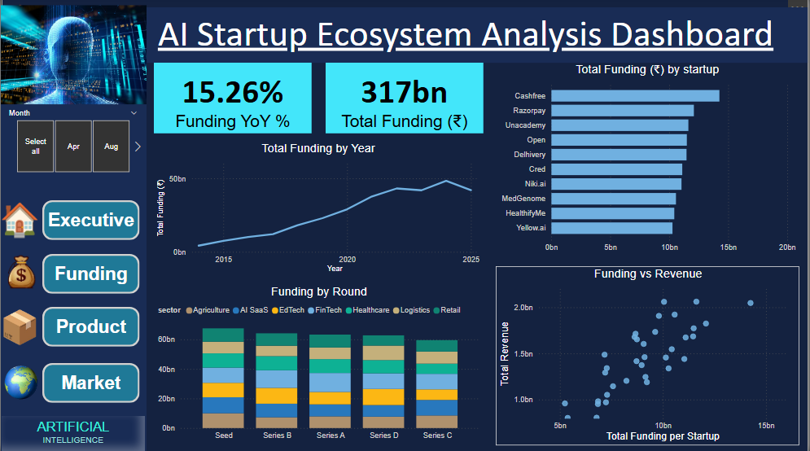
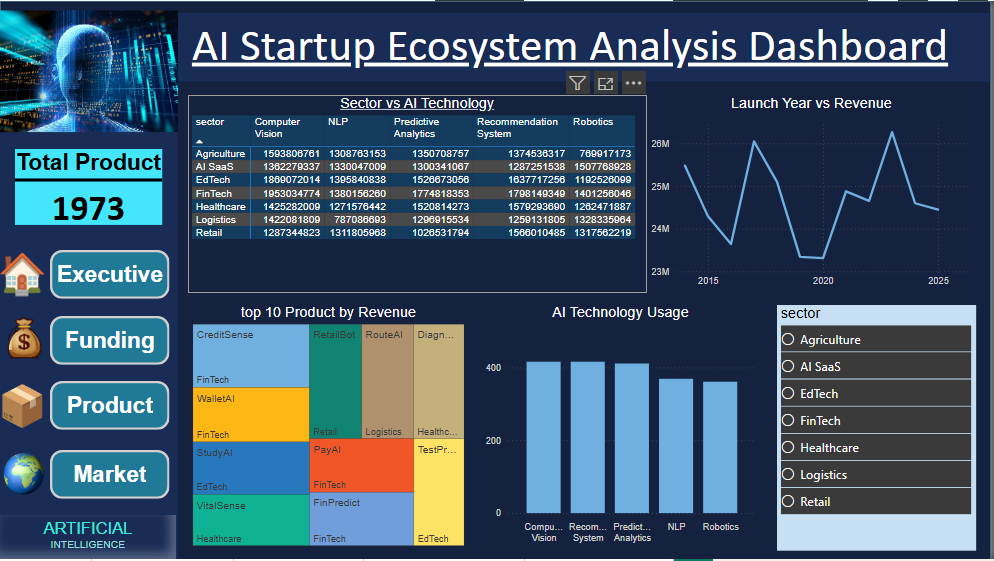
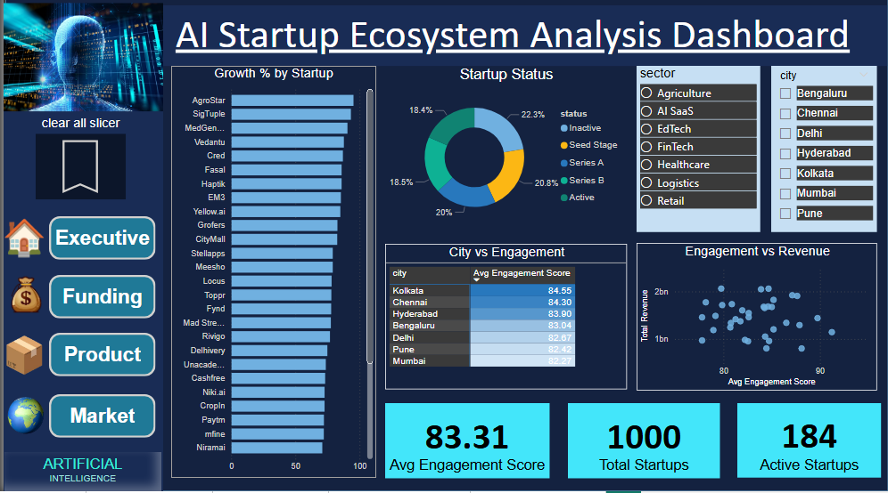

🚀 1. Project Overview

The AI Startups Analytics Dashboard is an end-to-end Business Intelligence project built using Power BI to analyze the growth, funding patterns, product innovation, and market engagement trends in the AI startup ecosystem.
This project transforms raw multi-source datasets into actionable insights for:
- Investors
- Startup founders
- Business analysts
- Market researchers
- Strategic decision-makers
The dashboard integrates startup data, funding rounds, product launches, and engagement metrics into a single interactive analytics solution.

🎯 2. Business Problem Statement

The AI startup ecosystem is rapidly growing, with increasing investments and innovation across industries. However, stakeholders often struggle to:
* Identify high-growth AI sectors
* Understand funding distribution patterns
* Measure startup innovation performance
* Analyze real market engagement beyond capital investment
* Compare regional and industry-based trends

## 📊 Dashboard Preview

### Executive Overview

### Funding Analysis

### Product & Innovation

### Market Engagement

“I developed an end-to-end Power BI dashboard analyzing the AI startup ecosystem. The project integrates multiple datasets including startups, funding rounds, products, and market engagements to provide a 360-degree performance view.

The dashboard tracks key KPIs such as total startups, active startups, total funding, revenue, funding per startup, and year-over-year funding growth using time intelligence functions.

One of the most impactful features I built was a composite Engagement Score, where I normalized engagement frequency and deal value, then applied weighted scoring to rank startups based on market strength.

This dashboard helps investors identify high-growth startups, supports founders in benchmarking performance, and enables strategy teams to analyze funding and revenue trends for data-driven decision-making.”

This dashboard solves these challenges by providing a centralized, interactive analytical view of the AI startup landscape.
